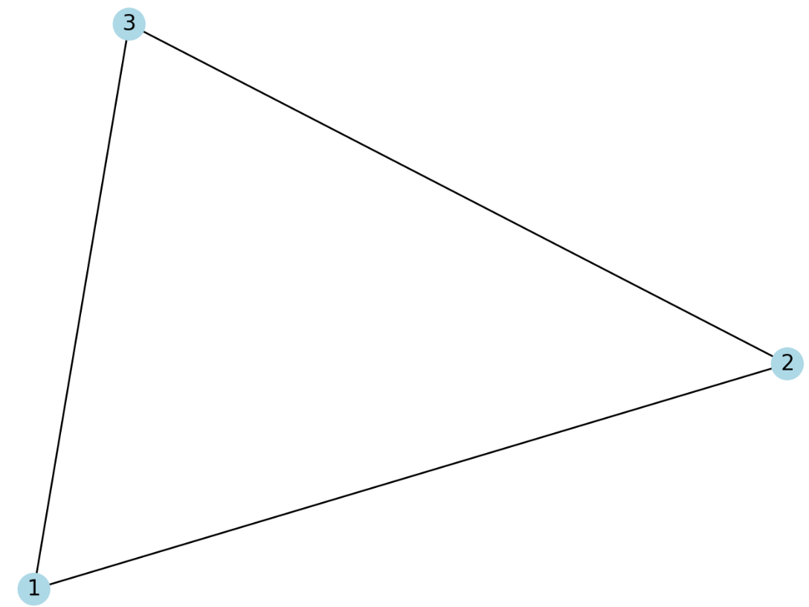
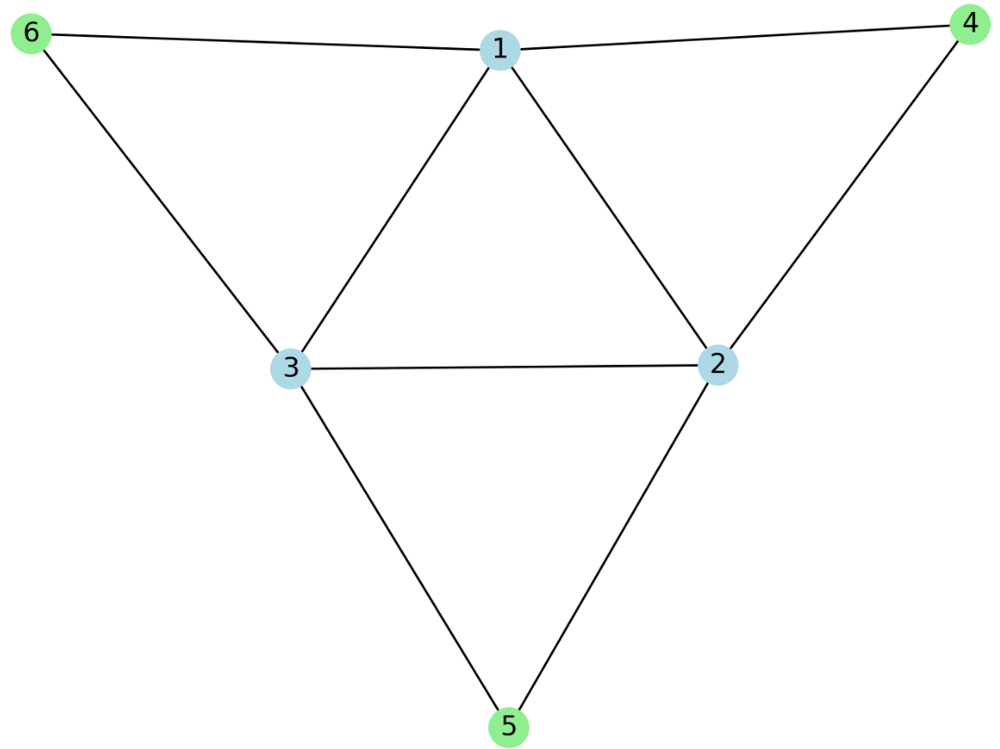
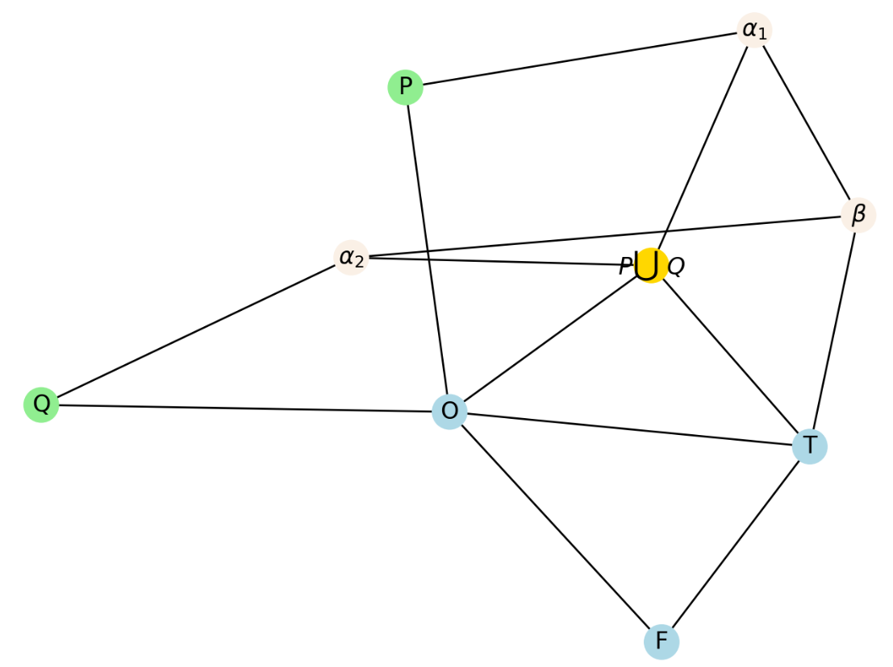
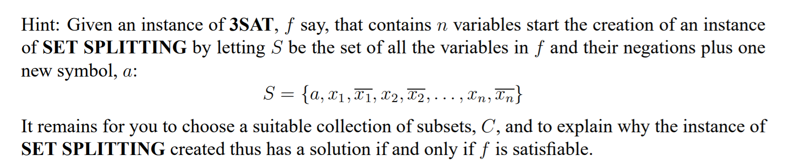

做一做课后题吧~

<!-- more -->

### NP-Complete问题乱证

#### 最长通路问题(longest path)

##### 实例

图$G=<V,E>$，是否存在一条长度至少为$K$的路

##### 证明

令$K = |V|$于是问题变成了Hamilton 通路问题，证毕。

#### 集合包装问题

##### 实例

令某个集合$|S| < \infty$, $C \subset 2^{S}$，$n = |C|$，询问是否存在$C$中的$k$个元素，使得任意两个互不交叉

##### 证明

这个问题显然是团问题...

#### 哈密尔顿子图划分(partition into Hamilton subgraph)

##### 实例

图$G$，能否被划分成$k$个互补相交的集合使得每个导出子图包含一个哈密尔顿回路

##### 证明

令$k=1$问题变成Hamilton 回路问题

#### 最大公共子图问题(largest common subgraph)

##### 实例

给两张图$G_{1}$，$G_{2}$，求两个最大的子图同构

##### 证明

令第二张图为大小为$k$的完全图，整个问题变成了团问题。

#### 最小平方和问题(minimum sum of squares)

##### 实例

有限集合$A$ ，每个元素$a \in A$，每个元素均有一个值$f: A \rightarrow R$

将集合$A$分成$K$个互补相交的集合，使得每个子集的平方和的和小于等于$J$

##### 证明

对于这个划分问题，考虑用二划分问题向这个方向来检测

考虑平方增长的速度比线性快得多，直接复制n份，然后规约二划分

这里不是很严谨，下次一定

#### 返回顶点集(feedback vertex set)

##### 实例

有向图$G=<V,A>$，正整数$K \leq |V|$

询问是否存在$V'\subset V$，$|V'|\leq K$，且$G$的每一条有向回路至少包含$V'$的一个点

##### 证明

这很显然是个击中集问题。

#### 四元素集合的严格覆盖(exact cover by 4-sets)

##### 实例

即X3C问题直接扩展成4的形式

##### 证明

考虑将X3C问题归约到X4C问题

对于每个X3C中的第$i$个集合$(a,b,c)$ ，直接扩展成$(a,b,c,d_{i})$

这样会多出$n$个分量，为了保证多出的$n$个分量，直接添加$C_{n}^{4}$个元素，来保证全部被覆盖

当然这样还是有问题的，即不一定能整除，直接补全就好了

#### 支配集问题(dominating set)

##### 实例

无向图$G=<V,E>$，$K \leq |V|, K\in N^{+}$

询问是否存在$V'\subset V$，st$|V'|\leq K$，且$\forall v\in V/V',st,\exists u\in V',uv\in E$

##### 证明

被我xjb画画出来了。

这个东西显然和点覆盖问题很像。

于是考虑用点覆盖问题规约到这个问题。

假设一个点覆盖的实例是$G'=<V',E'>$

构造一个新的图$G''=<V'',E''>$

其中对于$E'$中的每条边$uv$，**增量构造**一个新的点$d_{i}$，**增量构造**两条边$ud_{i},vd_{i}$

这个问题就变成了一个支配集问题。

来一张图看看。

基础点覆盖问题

新构造3个点4，5，6，转化成一个支配集的问题

#### 图3染色问题(graph 3-colorability)

##### 实例

世人皆知

##### 证明

爆智力*1

首先这个问题看起来就很3SAT，于是尝试从3SAT规约到这个问题。首先比较好想的一个部分就是

假设分别染成1，2，3这3种颜色，那么可以构造一个$K_{3}$，来指示真假。

然后就很困难了/youl

我在找了一发资料之后发现了下面这总构造方式，可以产生PQ的或$P\bigcup Q$

于是就很简单了...

至于怎么想出来的我还是不知道，我似乎对图论知识并不很敏感的样子...

#### 划分为长度为2的通路（partition into paths of length 2）

##### 实例

图$G=<V,E>$，$|V|=3q$

询问是否存在一个$V$的划分，使得每个互补相交的子集$V_{i}=\{v_{1},v_{2},v_{3}\}$

其点导出子图，存在一条长度为2的路。

##### 证明

考虑通过X3C问题规约到这个问题

假设有一个X3C的问题实例$(a_{i},b_{i},c_{i})$

构造$3q$个点，然后连边$(a_{i},b_{i}),(b_{i},c_{i})$

这样每次一个划分，就代表了选择了X3C问题中的一个元素。

#### k-median

##### 实例

世人皆知

##### 证明

考虑通过支配集问题归约到这个问题。

对于支配集问题的图$G=<V,E>$

将$V$中顶点复制一份作为工厂，每个点向自己和关联点连$d=0$的边。

然后就做完了/youl

#### Steiner tree

##### 实例

世人皆知

##### 证明

被爆智力*3，被爆到不想写证明了

http://profs.sci.univr.it/~rrizzi/classes/Complexity/provette/Santuari/steiner.pdf

#### 集合分裂问题（set splitting）

##### 实例

一个有限集$S$，$C \subset 2^{S}$

询问是否存在一个$S$的划分$S_{1},S_{2}$，使得$\forall x \in C, x \not\subset S_{1},x\not\subset S_{2}$

##### 证明

被爆智力*2

这个东西真的好靠直觉呀/youl，给个提示就好想了。

考虑使用3SAT归约到这个问题，下面来着手构造$C$

对于$(a_{i},b_{i},c_{i})$来说，构造$(a_{i},\overline a_{i}),(b_{i},\overline b_{i}),(c_{i},\overline c_{i})$

以及$(d, \overline a_{i}, \overline b_{i}, \overline c_{i})$

假设这个集合分裂问题得到了一个解，将$d$所在的集合的变量全设为真，其余全设为假。

