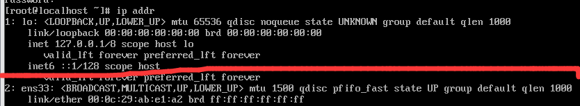
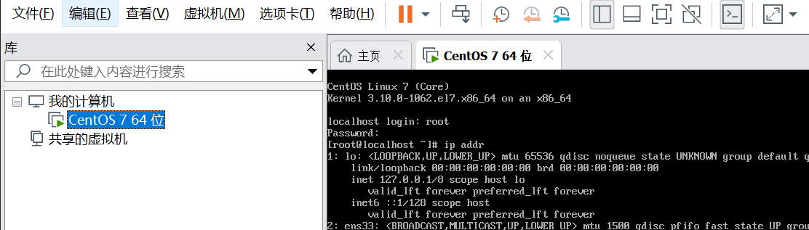
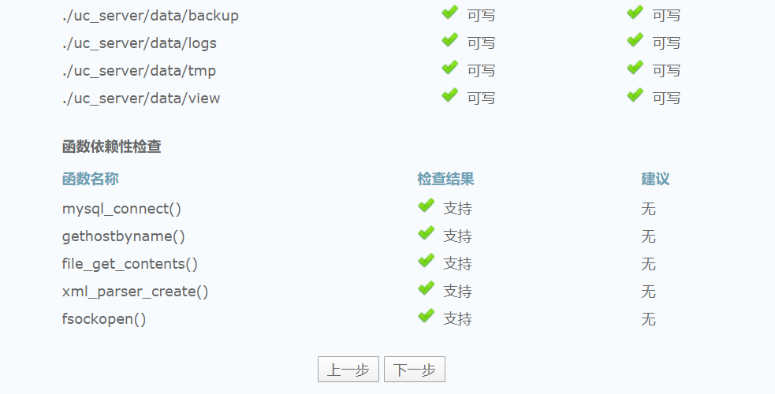
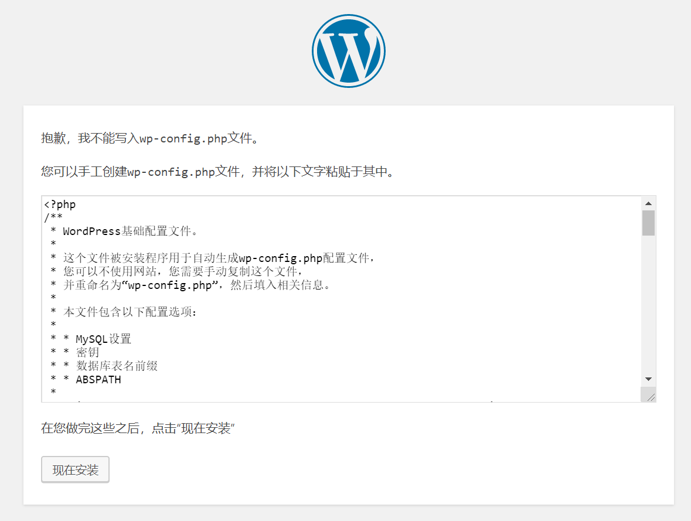

颓废了一个寒假,临末尾来搭一个Discuz+wordpress吧
<!--more-->

### 环境
系统 centos 7 

虚拟机 Vmware

Discuz X3.4

数据库 

### 一些linux指令简单介绍
#### reboot

重启

#### ll
显示当前目录文件和文件夹

相当于windows下的dir

#### cd
后面加文件夹名可以跳转到相应的文件夹中

和windows上的cd一样

另外

```
cd ~
```

是跳转到一开始的目录

```
cd ..
```
是跳转到上一层

#### vi
vi是linux中自带的记事本,不过相比较windows强了不知道多少倍...

它的GUI版本是熟悉的vim哦~

后面加文件名就可以打开或者创建文件

打开之后,要点一下i键才可以正常的编辑,如果和我版本一样的额话,可以在屏幕左下角看到一个INSERT

如果要保存或者退出,需要先点一下Esc键,这时候左下角的INSERT就会消失

输入
```
:wq
```
就代表保存并退出

这个时候你输入的指令都会显示在屏幕的最下面

输入
```
:q
```
代表退出

#### cp

cp指令就是复制啦
它的用法是
```
cp -参数 你要复制的 你要复制到哪里
```
现在只用到了一个参数

-r代表递归复制,简单来说就是复制文件夹

### windows下使用ssh

右键点击屏幕左下角的windows标志


选择Windows PowerShell

输入

```
ssh 用户名@ip地址
```
如果出现让你输yes/no就输yes

然后会让你输入密码

连接完之后你在PowerShell里输入什么,连接的电脑就会做什么了~


### 安装Vmware
这有啥好说的???

跳过
### 安装centos系统
~~这有啥好说的~~

一定要记好自己的密码,用户名默认是root

每次登录的时候都需要输入账号和密码


这里主要讲一下配置网络的细节吧

因为可以联网之后,就可以用ssh控制电脑了呢,就不用盯着虚拟机那个小框了呢~

先输入以下

```
ip addr
```

如果长成这样


注意看红线下面没有出现ip地址,这个时候就要手动配置一下网络

打开虚拟机设置


调整成桥接模式


然后回到虚拟机,输入

```
cd /etc/sysconfig/network-scripts
```
再输入
```
ll
```


输入

```
vi ifcfg-ens33
```

编辑ifcfg-ens33文件

顺便一提

linux在输入文件名的时候是可以按Tab键自动补全的

如果你玩过minecraft的话会好理解的~

~~比windows高到不知道哪里去了~~

把
```
ONBOOT=no
```
改成
```
ONBOOT=yes
```
保存退出

重启一下虚拟机

再输入一下ip addr


现在那个红线上面的ip地址就是你的虚拟机ip地址

现在可以用ssh链接你的虚拟机了~~

### 配置基本的环境
#### 在自己的电脑上安装git
由于这个可能不是太复杂就不展开说了
#### 关防火墙和SELinux
先要把什么防火墙之类的东西全关掉,防火墙什么的最讨厌了呢~

顺便一提,如果你登录的不是root的话,所有指令最好都带一个sudo前缀,保证你有足够的权限

依次输入
```
systemctl stop firewalld
```

```
systemctl disable firewalld
```


这样就把防火墙关掉了~

但是linux还有个叫SELinux的讨厌的东西

编辑/etc/selinux/config文件

再顺便一提,右键powershell就可以粘贴哦~

把对应的一行改成这个
```
SELINUX=disabled
```
保存退出

输入
```
setenforce 0
```

在输入
```
getenforce
```
如果显示Disabled就已经关掉了

如果不行就重启一下虚拟机吧~

#### 安装Apache

输入
```
yum -y install httpd
```
其中它让输yes就输

安装完成后

依次输入
```
systemctl start httpd
```
开启http
```
systemctl enable httpd
```
设置http开机启动
可以输入
```
systemctl status httpd
```

如果那个running变成了dead,极大的可能是有东西占用了80端口,比如阿里云就会自带nginx占用掉80端口

这个时候,输入
```
yum install net-tools
```
中间可能要输入一次y

完成之后输入
```
netstat -tlnp|grep 80
```

看到有程序在占用80端口,从右边可以看到进程号为1372,应用是httpd

这个地方由于我已经成功启动了httpd所以显示的是httpd,如果是什么其他的东西,就需要强行把这个应用停止,把80端口让给httpd
```
kill -9 进程号
```
直到80端口不再被占用

这时候
```
systemctl restart httpd
```
重启一下httpd

#### 安装Mariadb

输入
```
yum -y install mariadb-server.x86_64
```

顺便一提 Mariadb 是类似mysql开源版本的存在

默认的用户名是root

密码是空的

选它主要原因是开源(~~国内下载的快~~)

输入
```
systemctl start mariadb
```
开启服务

```
systemctl enable mariadb
```
设置开机启动

```
systemctl status mariadb
```
查看状态

#### 安装php和php-mysql
```
yum -y install php php-mysql
```

#### 安装git
```
yum install git -y
```

### 安装Discuz

我们用git把Discuz的文件下载下来

Discuz的项目地址在

https://gitee.com/ComsenzDiscuz/DiscuzX

还好不在github...


一次点击克隆,复制

输入
```
git clone 你复制到的东西
```

回到主目录,输入
```
ll
```

就能看到一个叫DiscuzX的文件夹,~~当然你有可能看不出它是文件还是文件夹~~

输入
```
cp -r DiscuzX/upload /var/www/html/upload
```
把DiscuzX下的upload文件夹复制到那个奇怪的目录下

那个目录下的东西会被Apache(httpd)给解析成我们熟悉的网页

现在需要给DiscuzX一点权限
依次输入
```
chmod -Rf 777 /var/www/html/
```

```
chmod -Rf 777 /var/www/html/upload
```

打开浏览器,输入
```
虚拟机的ip地址/upload
```


点我同意


点下一步*2


数据库密码调成空(如果你没有手动调整数据库密码的话)

记得填写管理员密码哦~

然后就安完了~

### 安装wordpress

先要整到wordpress的安装包

最近的官网不大友好...

而且由于centos7默认的php的版本太低了也不能装版本过高的wordpress

所以我选了wordpress-v5.0.2-zh_CN.zip

现在要用ssh把这个zip传到虚拟机上

我把这个zip放在了e盘

我用了git带的scp

在e盘右键点击git bush here

输入

```
scp wordpress-v5.0.2-zh_CN.zip root@192.168.0.107:wordpress-v5.0.2-zh_CN.zip
```

在powershell输入ll就能看到传上去的文件了

输入
```
yum install -y unzip zip
```
安装unzip

输入
```
unzip wordpress-v5.0.2-zh_CN.zip
```
解压这个zip包

输入
```
cp -r wordpress /var/www/html/wordpress
```

在浏览器输入
```
http://ip地址/wordpress
```
就能看到wordpress的安装界面了~


先别急着往下,现在我们要配置一下数据库

回到powershell

依次输入
```
mysql -uroot
```
打开数据库
```
create database wordpress;
```
建立要用的数据库
```
GRANT ALL ON wordpress.* TO 'wordpressuser'@'%' IDENTIFIED BY "123456";
```
建立该数据库的账户,最后一个双引号换成你要的密码

我这里用的123456

```
quit
```
退出数据库

```
systemctl restart mariadb
```
重启一下数据库

回到浏览器


依次填表

数据库主机填虚拟机的IP地址

如果你用的是阿里云之类的东西记得开放3306端口(数据库使用)

如果出现这个界面


回到powershell

输入
```
vi /var/www/html/wordpress/wp-config.php
```
复制网页里的东西

粘贴(记得右键)

退出保存

然后回浏览器,一直往下走就好了~

之后有空再更新如何把wordpress调成多人模式吧~~

### 参考网址

https://blog.csdn.net/xiehd313/article/details/80814584

https://blog.51cto.com/2382492/2083079

https://www.cnblogs.com/caicaizi/p/9564754.html

https://blog.csdn.net/sky101010ws/article/details/50782475

https://blog.csdn.net/weixin_42591732/article/details/102534262

https://www.cnblogs.com/biaopei/p/11683407.html

https://blog.csdn.net/weixin_42506905/article/details/90339253

https://www.cnblogs.com/lywJ/p/10880332.html

https://www.jianshu.com/p/ad58fd97119e
