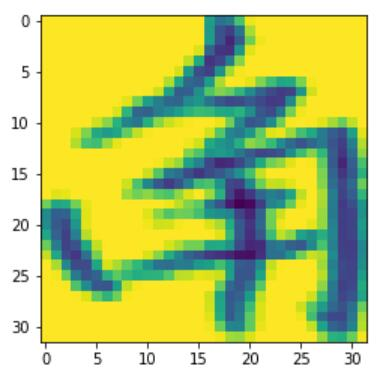

本文旨在为自身后日回忆~~并非用于教学~~
<!--more-->

本文强烈建议使用jupyter lab

---

## 第一步 得到数据集

~~不说了~~

---

## 第二步 解析一个文件

就来解析这个叫“1001-c.gnt”的文件吧

官网上有具体的文件格式

简单来说是，一个这样的文件中包含了多个图片

~~直接上代码好了~~

```python
import numpy as np
import struct
def load_raw_data(id):
    path = '../HWDB1.1trn_gnt/' + str(id) + '-c.gnt'
    file = open(path, 'rb')
    features = []
    labels = []
    while file.read(1) != '':
        file.seek(-1, 1)
        buf = file.read(4)
        if len(buf) != 4:
            break
        length_bytes = struct.unpack('<I', buf)[0]
        tag_code = file.read(2)
        width = struct.unpack('<H', file.read(2))[0]
        height = struct.unpack('<H', file.read(2))[0]
        content = file.read(height*width)
        img = np.frombuffer(content, dtype=np.uint8).reshape(height,width)
        features.append(img)
        labels.append(char_dict[tag_code.decode('gb2312')])
    return np.array(features), np.array(labels)
```

char_dict就不放在这里了，太长了

这个函数的第一个返回值是一个ndarray，每个元素是一个灰度图片

第二个返回值是labels数组代表了每个图片分别属的类别

然后随便说一些细节吧

1. 每次读完一个图片之后通过

```python
if len(buf) != 4:
	break
```

来判断文件是不是读完了

2. 中文编码是gb2312格式的
3. 读入文件的时候用np.frombuffer会快一点，尽量不要一个一个像素的读，py的速度太拉胯了
4. dtype=np.uint8 可以极限省内存

---

## 第三步 看看图片长啥样

```python
import matplotlib.pyplot as plt
features, labels = load_raw_data(1001)
plt.imshow(features[0])
```


同样也可以输出图片的大小
```python
print(features[0].shape)
```
如果你多看几张图片的话就会发现，基本上每张图片的大小都是不一样的，这显然(显然吗？)不能直接用，我们需要先把图片都转换成一样的大小

---

## 第四步 图片处理
以将图片最终转换成32*32为例
### 偷工减料的方法
pyTorch 有个叫做AdaptiveAvgPool2d的东西
导入pytorch的相关东西
```python
import torch.nn as nn
import torch
ft = nn.AdaptiveAvgPool2d((32, 32))
```
为了使用pytorch就必须把原来图片的numpy形式转换成pytorch使用的Tensor形式
还要注意把数据格式改成float格式才能作为参数传到网络里
最后还要注意添加一维作为通道维
反正挺烦的
```python
img = torch.from_numpy(features[0])
img = torch.from_numpy(features[0]).float().view(1, features[0].shape[0], features[0].shape[1])
new_img = ft(img)
```
可以再输出一下img的大小
```python
print(img.shape)
```
可以发现变成了(1, 32, 32)，第一个1是指一个通道，不了解也没关系(
把图片plot出来看看

```python
plt.imshow(new_img[0])
```

虽然大小对了，但是图像完全走样了...

### 手工缩放图像
没想到好的办法，只能手动缩放了，这里主要使用了PIL的Image模块
```python
from PIL import Image
```
幸运的是，Image可以通过numpy的ndarray直接生成灰度图
```python
img = Image.fromarray(features[0])
```
假设我们想把图片转换成高h宽w（假设图片的原来大小为高x宽y）
不妨假设h=w=0好了~~好萌啊~~
我们就能得到图片的缩放比例
```python
h,w = 32,32
x,y = features[0].shape
ratio = min(h/x, w/y)
```
然后通过PIL来进行图片的缩放
```python
x,y = int(ratio*x), int(ratio*y)
img = img.resize((y,x), Image.ANTIALIAS)
```
resize的第一个参数是指要变换后的大小, **这里有个坑点，排在前面的是width**
第二个参数是指插值方法
如果你不知道到底做的对不对可以通过
```python
print(img.size) # 查看图片的大小
img.show() # 康康图片长啥样
```
最后我们要把图片补成高h宽w（为什么还要补原因自己想去
没有太好的方法，我们就采用一种奇技淫巧
先创建一张空图
```python
new_img = Image.new('L',(w, h), 255)
```
'L'代表为灰度图，第二个参数依旧是**width在前面**，255表示每个像素点都是255即白色
然后我们把之前resize的图片粘到这张空图的中间
```python
x,y = int((h-x)/2), int((w-y)/2)
new_img.paste(img, (y, x))
```
paste的第二个参数表示img的左上角处于哪个位置，**width在前**
最后只需要从Image转会ndarray就好了
```python
arr = np.asarray(new_img)
plt.imshow(arr)
```
发现效果好多了


---

## 一些补充
在缩放图片的时候可以引入一些随机因素，来提高模型的泛化能力
比如, 让图片不一定被放缩到最大
```python
h,w = 32,32
x,y = features[0].shape
ratio = min((h-np.random.randint(3,5))/x, (w-np.random.randint(3,5))/y)
```
