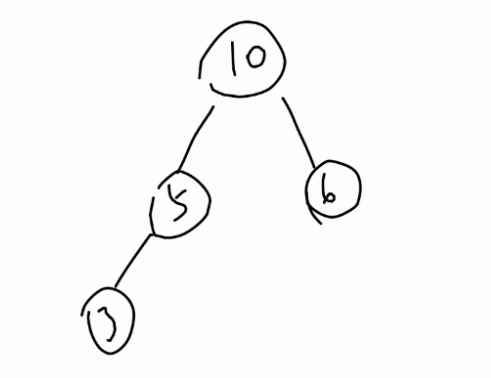

### 23树的一种删除方法


似乎网上没有什么对于23树删除时候的教程

即使是有的那些也是躲躲闪闪，不讲个明白，本文尽我最大的可能将这个操作讲明白（最后还是鸽了

不同于本人的别的blog，这次本人花巨资画了示意图（

但是这个blog别人也看不到呀（（

#### 参考资料

[网上的2-3树教程](https://www.cs.drexel.edu/~amd435/courses/cs260/lectures/L-6_2-3_Trees.pdf)

挺可惜的是这篇2-3树有两种删除时候的情况没有讨论，可能是太简单了吧（

#### 删除

##### 分析大纲

为了保证排版我用缩进简单介绍一下思路

```cpp
删除的是非叶子结点
    
删除的是叶子结点
    删除的是3type结点
    
    删除的是2type结点
    	2type结点的父亲是2type结点
    		2type结点的兄弟是2type结点
    		2type结点的兄弟是3type结点
    
    	2type结点的父亲是3type结点
    		2type结点存在一个兄弟是2type结点
    		2type结点存在一个兄弟是3type结点
```


首先我们要删除一个结点的话。

我们要找到那个结点在哪里。

我们首先根据删除结点的情况进行分类。

1. 要删除的结点不是叶子结点

2. 要删除的结点是叶子结点

---

##### 删除的不是叶子结点

这时候我们找到这个结点的后继，然后把后继的值和要删除结点的值swap一下。

然后只需要删除后继就好了。

那...为什么要这么做呢，一来这样依旧能够保证整棵树的中序遍历的正确性。

此外这个结点的后继一定是一个叶子！我们接下来就来证明这个结论。

---

###### 一个非叶子结点的后继一定是一个叶子

如果你学过其他的种类的平衡树的话，你会发现这个性质是一般平衡树所没有的。

例如


其中5结点的后继6就不是一个叶子

原因在于5的后继可能有右儿子，但是在2-3树中保证了除叶子节点外，每个分支节点的儿子数量是满的，于是意味着一个结点一旦有儿子，则一定有很多儿子，这个它是一个后继相矛盾，可以自己想想。

---

###### 一个非叶子结点的后继一定在右儿子中

这个也是普通平衡树所没有的性质。

举个栗子。



考虑5的后继，显然得到了后继不一定在右儿子中的结论。

由于2-3保证了所有分支结点一定有多个儿子，于是证明显然。

有了以上两条性质的保证。我们就可以知道经过上面两个步骤，一个删除非叶子结点的操作，被转化成了一个删除叶子结点的操作。

---

##### 删除的是叶子结点

于是本质上只有删除的是叶子结点的操作。

我们考虑接着来分析问题

-----

##### 删除的是3type结点

由于这个叶子结点有多个值，直接删掉那个，然后把这个结点改成2type结点就好了。

举个栗子。


----

##### 删除的是2type结点

这个时候我们肯定不能直接把这个结点删了，不然树就不一样高了。

于是我们只能寻求它的父亲或者兄弟的帮助。

继续进行分类讨论

1. 2type结点的父亲是3type结点
2. 2type结点的父亲是2type结点

-----

##### 2type结点的父亲是2type结点 且有一个3type兄弟


其中A代表被删除的叶子，这样调整一下顺序就完成了调整过程。

---

##### 2type结点的父亲是2type结点 且有一个2type兄弟


A是要被删除的结点，经过这样的调整，把A拉到了最上面，但是并没有完全处理完成，需要继续向上递归，不过我们先完成对删除叶子一步的操作，之后我们再统一讨论如果递归地处理。

---

##### 2type结点的父亲是3type结点 且有一个兄弟是2type结点


删除A结点，只需要将B和C压成一个结点并且把父亲变成2type就好了，再次注意这里A是个叶子，A是子树的情况之后再讨论

---

##### 2type结点的父亲是3type结点 且有一个兄弟是3type结点


思路类似在此不再赘述。

---

##### 对于递归处理的讨论

可以发现对于删除A这个叶子的一步操作中只有**2type结点的父亲是2type结点 且有一个2type兄弟**这种情况下，我们必须要进行向上递归处理。

观察这个时候，向上处理时$A$是一颗子树，且之后一个儿子，这个性质非常关键。

事实上下面的讨论与上面的讨论的区别就在于，被删除的结点A从一个叶子，变成了一个只有一个儿子的且根为A的子树的根。


递归时A也会遇到

1. 2type结点的父亲是2type结点 且有一个3type兄弟
1. 2type结点的父亲是2type结点 且有一个2type兄弟
1. 2type结点的父亲是3type结点 且有一个兄弟是2type结点
1. 2type结点的父亲是3type结点 且有一个兄弟是3type结点

这4种情况

---

##### 2type结点的父亲是2type结点 且有一个3type兄弟

由于现在A不再是叶子了，于是讨论要加上子树。

调整如图


---

##### 2type结点的父亲是2type结点 且有一个2type兄弟

调整方式如下，可以发现这种情况下还需要继续向上递归


---

##### 2type结点的父亲是3type结点 且有一个兄弟是2type结点

调整方式如下


----

##### 2type结点的父亲是3type结点 且有一个兄弟是3type结点

调整方法如下


---

综合以上3种情况，可以发现还是只有一种情况需要继续向上递归，这时依旧满足子书中只有一个儿子，于是可以继续上面的过程

最终要么终止于没有父亲，要么终止于其他3种情况

##### 递归过程中没有父亲

这时需要重新指定整个2-3树的根


----

完结散花（

贴个代码吧

```cpp
#include <iostream>
#include <algorithm>
#include <cassert>
using namespace std;
template<typename T>
class _23Tree{
private:
    struct Node{
        Node *ch[4], *fa;
        T data[3];
        unsigned int height;
        bool isThree;
    };
    Node *createNode();
    Node *root;
    void maintain(Node *x);
    void erase_maintain(Node *);
    void _display(Node *x);
    Node *_find(T);
public:
    _23Tree();
    unsigned int getHeight()const;
    void insert(T);
    void erase(T);
    bool find(T);
    void display();
};

template<typename T>
_23Tree<T>::_23Tree(){
    root = nullptr;
}

template<typename T>
typename _23Tree<T>::Node *_23Tree<T>::createNode(){
    Node *t = new Node();
    // clear node
    for(int i = 0; i < 3; i++)t->ch[i] = nullptr;
    t->fa = nullptr;
    t->height = 0;
    t->isThree = false;
    return t;
}

template<typename T>
void _23Tree<T>::maintain(_23Tree<T>::Node *x){
    // maintain for a single tree
    // whose father is to be inserted
    // initially x's father exists
    Node *y = x->fa;
    if(y->isThree){
        // when x's father is 3-type

        //find the loc
        int ch_loc = 0;
        for(int i = 0; i < 3 ; i++){
            if(y->ch[i] == x) {
                ch_loc = i;
                break;
            }
        }

        //insert the pointers into y
        for(int i = 3; i > ch_loc; i--){
            y->ch[i] = y->ch[i - 1];
        }
        y->ch[ch_loc] = x->ch[0];
        y->ch[ch_loc+1] = x->ch[1];
        for(int i = 0 ; i < 4; i++){
            y->ch[i]->fa = y;
        }

        //insert data into y
        y->data[2] = x->data[0];
        sort(y->data, y->data+3);

        //split y
        Node *tmp = createNode();
        Node *p1 = createNode();
        Node *p2 = createNode();
        tmp->data[0] = y->data[1];
        p1->data[0] = y->data[0];
        p2->data[0] = y->data[2];

        p1->ch[0] = y->ch[0];
        p1->ch[1] = y->ch[1];
        p2->ch[0] = y->ch[2];
        p2->ch[1] = y->ch[3];
        p1->fa  = p2->fa = tmp;
        p1->ch[0]->fa = p1->ch[1]->fa = p1;
        p2->ch[0]->fa = p2->ch[1]->fa = p2;
        tmp->ch[0] = p1;
        tmp->ch[1] = p2;
        p1->height = p2->height = y->height;
        tmp->height = p1->height + 1;

        // exchange y's father
        Node *z = y->fa;
        tmp->fa = z;
        if(z == nullptr){
            root = tmp;
        }else{
            int child_size = z->isThree ? 3 : 2;
            for(int i=0;i<child_size ;i++){
                if(z->ch[i] == y){
                    child_size = i;
                    break;
                }
            }
            z->ch[child_size] = tmp;
            delete y;
            maintain(tmp);
        }

    }else{
        // when x's father is 2-type
        y->isThree = true;
        //find the loc
        int ch_loc = 0;
        for(int i = 0; i < 2; i++){
            if(y->ch[i] == x){
                ch_loc = i;
                break;
            }
        }
        ch_loc ^= 1;

        // insert the pointer into y
        if(ch_loc == 0){
            y->ch[1] = x->ch[0];
            y->ch[2] = x->ch[1];
        }else{
            y->ch[2] = y->ch[1];
            y->ch[0] = x->ch[0];
            y->ch[1] = x->ch[1];
        }
        for(int i=0;i<3;i++){
            y->ch[i]->fa = y;
        }

        //insert the data into y
        y->data[1] = x->data[0];
        std::sort(y->data, y->data+2);
        delete x;
    }
}

template<typename T>
unsigned int _23Tree<T>::getHeight()const{
    return root->height;
}

template<typename T>
void _23Tree<T>::insert(T x){
    Node *cur = root;
    if(cur == nullptr){
        root = createNode();
        root->data[0] = x;
        return;
    }
    Node *y = cur;
    while(cur != nullptr){
        int R = cur->isThree ? 2 : 1;
        int i;
        for(i = 0; i < R; i++){
            if(cur -> data[i] < x){
//                break;
            }else{
                break;
            }
        }
//        i = min(i, R-1);
        y = cur;
        cur = cur->ch[i];
    }
    if(y->isThree){
        //insert new node
        y->data[2] = x;
        std::sort(y->data, y->data+3);

        // cur is y's father
        cur = y->fa;

        // split 4-type node
        Node *tmp = createNode();
        Node *p1 = createNode();
        Node *p2 = createNode();
        p1->data[0] = y->data[0];
        tmp->data[0] = y->data[1];
        p2->data[0] = y->data[2];
        tmp->ch[0] = p1;
        tmp->ch[1] = p2;
        p1->fa = tmp;
        p2->fa = tmp;
        tmp->height = 1;
        tmp->fa = y->fa;

        //exchange cur's son to the new 3 node
            //when father is nullptr
        if(cur == nullptr){
            root = tmp;
            delete y;
            return;
        }
            //when father exists
        int child_size = (cur->isThree ? 3 : 2);
        for(int i = 0; i < child_size; i++){
            if(cur -> ch[i] == y){
                child_size = i;
                break;
            }
        }
        cur->ch[child_size] = tmp;
        tmp->fa = cur;
        delete y;

        //update recursively
        maintain(tmp);

    }else{
        y->data[1] = x;
        std::sort(y->data, y->data+2);
        y->isThree = true;
    }
}

template<typename T>
void _23Tree<T>::erase(T v) {
    Node *x = _find(v);
    if(x == nullptr) return;
    if(x->ch[0] == nullptr){
        // x is leaf
        if(x->isThree){
            int child_size = x->isThree ? 2 : 1;
            x->isThree = false;
            int loc = 0;
            for(loc = 0; loc < child_size; loc++){
                if(x->data[loc] != v)break;
            }
            swap(x->data[loc], x->data[0]);
            x->data[1] = T{};
        }else{
            erase_maintain(x);
        }
    }else{
        // x is not leaf
        int loc = 0;
        int child_size = x->isThree ? 2 : 1;
        for(loc = 0; loc < child_size; loc ++){
            if(x->data[loc] == v)break;
        }
        assert(loc < child_size);

        // find next in InOrder
        Node *y = x->ch[loc + 1];
        while(y->ch[0] != nullptr)
            y = y->ch[0];
        x->data[loc] = y->data[0];

        if(y->isThree){
            int child_size = y->isThree ? 2 : 1;
            y->isThree = false;
            swap(y->data[1], y->data[0]);
            y->data[1] = T{};
        }else{
            erase_maintain(y);
        }

    }

}

template<typename T>
bool _23Tree<T>::find(T v) {
    return (_find(v) != nullptr);
}

template<typename T>
void _23Tree<T>::display() {
    _display(root);
}

template<typename T>
void _23Tree<T>::_display(_23Tree::Node *x) {
//    cout << x << endl;
    if(x == nullptr) return;

    int child_size = x->isThree ? 2 : 1;
    //son list
    _display(x->ch[0]);
    for(int i=0;i<child_size;i++){
        cout << x->data[i] << " " << x->height << endl;
        _display(x->ch[i+1]);
    }
}

template<typename T>
typename _23Tree<T>::Node *_23Tree<T>::_find(T v) {
    Node *x = this->root;
    while(x != nullptr){
        int child_size = x->isThree ? 2 : 1;
        bool flag = false;
        for(int i=0;i<child_size;i++){
            if(x->data[i] == v)flag = true;
        }
        if(flag) break;
        int i = 0;
        for(i=0;i<child_size;i++){
            if(v < x->data[i])break;
        }
        x = x->ch[i];
    }
    return x;
}

template<typename T>
void _23Tree<T>::erase_maintain(_23Tree::Node *x) {
    int child_size = x->isThree ? 2 : 1;
    // x is 2-type node
    Node *y = x->fa;
    if(y == nullptr){
        // when father doesn't exist
        root = x->ch[1];
    }else{
        // when father exists

        //find x's location in y
        child_size = y->isThree ? 2 : 1;
        int loc = -1;
        for(int i=0; i<= child_size; i++){
            if(y->ch[i] == x){
                loc = i;
                break;
            }
        }
        assert(loc != -1);

        if(y -> isThree){
            // father is 3-type node
            int to = 0;
            if(loc == 0)to = 1;
            if(loc == 1)to = 2;
            if(loc == 2)to = 1;
            Node *w = y->ch[to];
            if(w->isThree){
                if(loc == 0){
                    if(x->ch[0] == nullptr) x->ch[0] = x->ch[1];
                    x->data[0] = y->data[0];
                    y->data[0] = w->data[0];
                    w->data[0] = w->data[1];
                    w->data[1] = T{};
                    w->isThree = false;
                    x->ch[1] = w->ch[0];
                    for(int i=0;i<=1;i++)w->ch[i] = w->ch[i+1];
                    w->ch[2] = nullptr;
                    if(x->ch[1]!=nullptr)x->ch[1]->fa = x;
                }else if(loc == 1){
                    if(x->ch[0] == nullptr) x->ch[0] = x->ch[1];
                    x->data[0] = y->data[1];
                    y->data[1] = w->data[0];
                    w->data[0] = w->data[1];
                    w->data[1] = T{};
                    w->isThree = false;
                    x->ch[1] = w->ch[0];
                    for(int i=0;i<=1;i++)w->ch[i] = w->ch[i+1];
                    w->ch[2] = nullptr;
                    if(x->ch[1]!=nullptr)x->ch[1]->fa = x;
                }else{
                    if(x->ch[1] == nullptr) x->ch[1] = x->ch[0];
                    x->data[0] = y->data[1];
                    y->data[1] = w->data[1];
                    w->data[1] = T{};
                    w->isThree = false;
                    x->ch[0] = w->ch[2];
                    w->ch[2] = nullptr;
                    if(x->ch[0]!=nullptr)x->ch[0]->fa = x;
                }
            }else{
                if(loc == 0){
                    w->isThree = true;
                    w->data[1] = w->data[0];
                    w->data[0] = y->data[0];
                    y->data[0] = y->data[1];
                    y->data[1] = T{};
                    y->isThree = false;
                    for(int i=0;i<=1;i++)y->ch[i] = y->ch[i+1];
                    y->ch[2] = nullptr;
                    for(int i=1;i>=0;i--)w->ch[i+1] = w->ch[i];
                    w->ch[0] = x->ch[0]==nullptr ? x->ch[1] : x->ch[0];
                    for(int i=0;i<=2;i++)if(w->ch[i]!=nullptr)w->ch[i]->fa = w;
                    delete x;
                }else if(loc == 1){
                    w->isThree = true;
                    w->data[1] = w->data[0];
                    w->data[0] = y->data[1];
                    y->data[1] = T{};
                    y->isThree = false;
                    y->ch[1] = y->ch[2];
                    y->ch[2] = nullptr;
                    for(int i=1;i>=0;i--)w->ch[i+1] = w->ch[i];
                    w->ch[0] = x->ch[0]==nullptr ? x->ch[1] : x->ch[0];
                    for(int i=0;i<=2;i++)if(w->ch[i]!=nullptr)w->ch[i]->fa = w;
                    delete x;
                }else{
                    w->isThree = true;
                    w->data[1] = y->data[1];
                    y->data[1] = T{};
                    y->isThree = false;
                    y->ch[2] = nullptr;
                    w->ch[2] = x->ch[0]==nullptr ? x->ch[1] : x->ch[0];
                    for(int i=0;i<=2;i++)if(w->ch[i]!=nullptr)w->ch[i]->fa = w;
                    delete x;
                }
            }
        }else{
            // father is 2-type node
            Node* w = y->ch[loc^1];
            if(w->isThree){
                w->isThree = false;
                if(loc == 1){
                    x->data[0] = y->data[0];
                    y->data[0] = w->data[1];
                    w->data[1] = T{};
                    if(x->ch[1] == nullptr) x->ch[1] = x->ch[0];
                    x->ch[0] = w->ch[2];
                    w->ch[2] = nullptr;
                    if(x->ch[0] != nullptr)x->ch[0]->fa = x;
                }else{
                    x->data[0] = y->data[0];
                    y->data[0] = w->data[0];
                    w->data[0] = w->data[1];
                    w->data[1] = T{};
                    if(x->ch[0] == nullptr) x->ch[0] = x->ch[1];
                    x->ch[1] = w->ch[0];
                    w->ch[0] = w->ch[1];
                    w->ch[1] = w->ch[2];
                    w->ch[2] = nullptr;
                    if(x->ch[1] != nullptr)x->ch[1]->fa = x;
                }
            }else{
                w->isThree = true;
                w->data[1] = y->data[0];
                //y->data[0] = 20000526;
                sort(w->data, w->data+2);
                if(x->ch[0] == nullptr) x->ch[0] = x->ch[1];
                if(loc == 0){
                    w->ch[2] = w->ch[1];
                    w->ch[1] = w->ch[0];
                    w->ch[0] = x->ch[0];
                    if(w->ch[0] != nullptr)w->ch[0]->fa = w;
                }else{
                    w->ch[2] = x->ch[0];
                    if(w->ch[2] != nullptr)w->ch[2]->fa = w;
                }
                y->ch[loc] = nullptr;
                delete x;
                erase_maintain(y);
            }
        }
    }

}

int data[100000];
int main(int argc, char **argv){
//    freopen("1.txt","w",stdout);
    srand(0);
    _23Tree<int> x;
    int n = 20;
    for(int i=1;i<=n;i++)
        data[i] = i;
    random_shuffle(data+1, data+1+n);
    for(int i=1;i<=n;i++){
        x.insert(data[i]);
    }

    for(int i=1;i<=n/4;i++){
        x.erase(data[i]);
        cout << "erase " << data[i] << endl;
//        x.display();
    }
    x.display();
    cout << x.getHeight() << endl;
    return 0;
}
```

