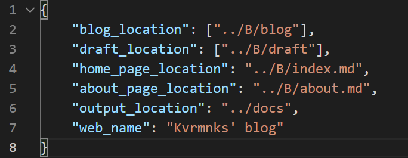

## White-Blog

起名收到white-album的启发

### 简介

由于我受够了每次配blog的繁琐过程。

于是我写这个简陋的blog解析生成器，简单来说就是给markdown文件一个显示的模板。

基于c和python的实现，没有额外的需要配的环境，当然功能也比较简陋。。。

有一个依赖项目https://github.com/kjdev/hoextdown

但是是纯c写的，应该也比较方便跨平台

简单的展示：[demo](https://www.kvrmnks.top)

### 开发日志

2021.1.12 实现简单的解析，支持递归解析，以及简单的代码栏

2021.1.14 实现目录的解析，以及摘要的markdown化

2021.1.21 调整了一下图片的表示方式

2021.1.24 感谢[@icy](https://github.com/icy-blue)实现了目录界面的瀑布式布局以及拖拽卡片功能

2021.1.25 写了一个投机取巧的分页

2021.2.4 将常量封装至json文件中，添加多个文件夹的渲染和草稿的渲染，加入“上一篇” 与 “下一篇”链接，加了个favicon（并不知道能不能用）

### 使用教程

#### 配置文件

在src目录下的user_config.json



* blog_location 中填入博客根目录 支持多个根目录
* draf_location 中填入草稿根目录 支持多个根目录
* home_page_location  用于生成主页的markdown文件的地址 (暂不支持主页的附属文件)
* about_page_location 用于生成关于的markdown文件的地址 (暂不支持关于的附属文件)
* output_location 用于输出整个网络文件的地址
* web_name 网页的名称

#### 文件结构


docs是保存博客文件的文件夹，即**存markdown的地方**

site是生成博客文件的文件夹，即**生成html文件的地方**

src是这个工程使用的代码和其他文件

##### markdown文件的结构


在这个例子中

```
docs 这层下有两个文件 与 一个文件夹
	分别是index.md 与 about.md
	index.md 是整个博客的主页
	about.md 是整个博客的“关于”页面
	
	blog文件夹下存放着所有markdown文件
		之后的3层文件夹分别是年月日，年为4位，月为2位（即前补零），日为2位（即前补零）
			在“日”的文件夹中，直接存放着属于该日期的每篇博客
				如图中“一些学习过程中用到的电子书”文件夹下的.md文件
				其余属于该篇博客的文件，如音频，视频与图片等也存放于该文件夹下
```

#### 如何运行

先配置user_config.json

然后直接运行main.py

#### 生成的结果


在这个例子中即site文件夹，该结果可以直接部署。


### todo

- [ ] 加个配置器
- [ ] 夜间模式？
- [ ] blog目录的自动生成与摘要的自动生成 	
- [x]  加个比较友好图片查看方式，比如zoom.js 	
- [x] blog目录的分页