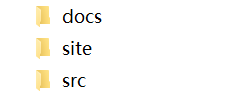
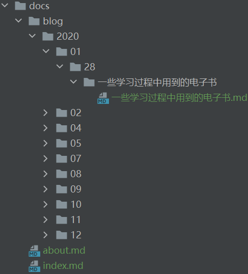
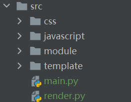
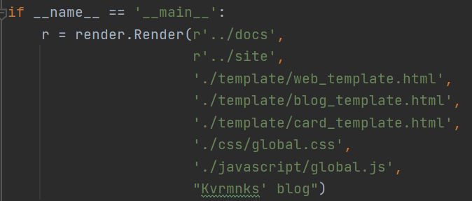
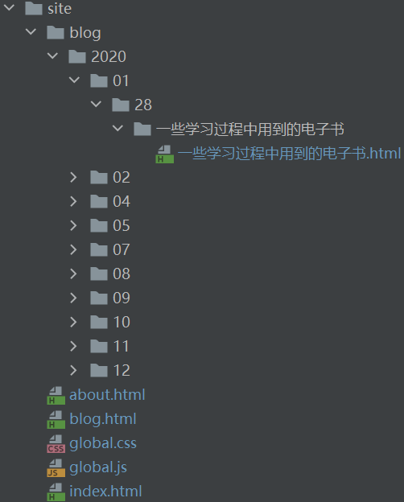

### White-Blog

起名收到white-album的启发（

#### 简介

由于我受够了每次配blog的繁琐过程。

于是我写这个简陋的blog解析生成器，简单来说就是给markdown文件一个显示的模板。

基于c和python的实现，没有额外的需要配的环境，当然功能也比较简陋。。。

有一个依赖项目https://github.com/kjdev/hoextdown

但是是纯c写的，应该也比较方便跨平台

简单的展示：[demo](https://www.kvrmnks.top)

#### 开发日志

2021.1.12 实现简单的解析，支持递归解析，以及简单的代码栏

2021.1.14 实现目录的解析，以及摘要的markdown化

2021.1.21 调整了一下图片的表示方式

2021.1.24 感谢[@icy](https://github.com/icy-blue)实现了目录界面的瀑布式布局以及拖拽卡片功能

#### 使用教程


##### 文件结构



docs是保存博客文件的文件夹，即**存markdown的地方**

site是生成博客文件的文件夹，即**生成html文件的地方**

src是这个工程使用的代码和其他文件

###### markdown文件的结构



在这个例子中

```
docs 这层下有两个文件 与 一个文件夹
	分别是index.md 与 about.md
	index.md 是整个博客的主页
	about.md 是整个博客的“关于”页面
	
	blog文件夹下存放着所有markdown文件
		之后的3层文件夹分别是年月日，年为4位，月为2位（即前补零），日为2位（即前补零）
			在“日”的文件夹中，直接存放着属于该日期的每篇博客
				如图中“一些学习过程中用到的电子书”文件夹下的.md文件
				其余属于该篇博客的文件，如音频，视频与图片等也存放于该文件夹下
```

##### 如何运行



先配置main.py中的路径信息

然后直接运行main.py



关键在于render.Render 的前两个路径

第一个表示保存markdown文件的路径

第二个表示生成html的路径

##### 生成的结果



在这个例子中即site文件夹，该结果可以直接部署。


#### todo
1. blog目录的自动生成与摘要的自动生成 	

2. 加个比较友好图片查看方式，比如zoom.js 	完成√

3. blog目录的分页