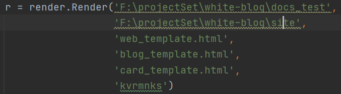

### White-Blog

起名收到white-album的启发（

#### 简介

由于我受够了每次配blog的繁琐过程

于是我写这个简陋的blog解析生成器。

基于c和python的实现，没有额外的需要配的环境，当然功能也比较简陋。。。

有一个依赖项目https://github.com/kjdev/hoextdown

但是是纯c写的，应该也比较方便跨平台

#### 使用教程

修改第一个参数为需要解析的blog基地址，第二个参数为需要生成网页的路径

具体格式在项目的docs_test中有演示

2021.1.14 版本演示

另附[demo](https://kvrmnks.gitee.io/web_test//index.html)

对照[mkdocs生成的](https://kvrmnks.github.io/)

#### 开发日志
2021.1.12 实现简单的解析，支持递归解析，以及简单的代码栏

2021.1.14 实现目录的解析，以及摘要的markdown化

2021.1.21 调整了一下图片的表示方式
#### todo
1. blog目录的自动生成与摘要的自动生成 	
2. 加个比较友好图片查看方式，比如zoom.js 完成√